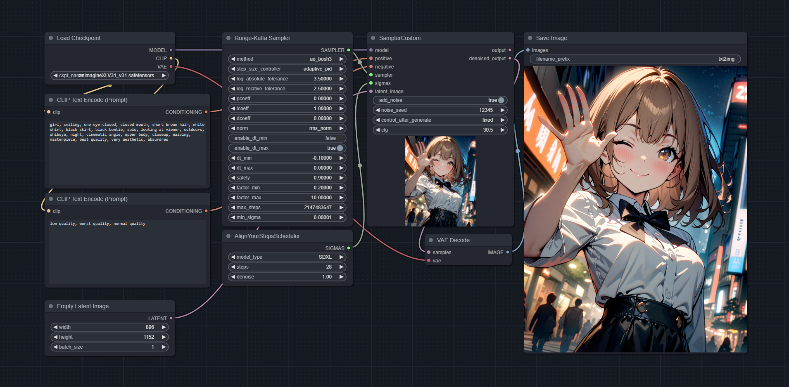

# ComfyUI-RK-Sampler


#### Batched Runge-Kutta Samplers for [ComfyUI](https://github.com/comfyanonymous/ComfyUI)
Supports most practical Explicit Runge-Kutta (ERK) methods.

Tested on SD1.5, SDXL, and SD3.

## Features
- Parallel ODE solvers for fast batch processing
- Explicit and Embedded Explicit Runge-Kutta methods
- PID controller for adaptive step sizing with tunable settings
- Scheduled controller for fixed step sizing (determined by the given $\sigma$ schedule)

## Installation
### ComfyUI-Manager
```
ComfyUI Manager Menu > Install via Git URL > https://github.com/wootwootwootwoot/ComfyUI-RK-Sampler.git
```

### Manual installation
> From `ComfyUI/custom_nodes` and ComfyUI virtual environment
```
git clone https://github.com/wootwootwootwoot/ComfyUI-RK-Sampler.git
pip install torchode
```

## Usage

[Basic workflow](./workflows/workflow_comfyui_rk_sampler.json)

> From `Add Node`
```
sampling > custom_sampling > samplers > Runge-Kutta Sampler
```

### Best defaults
- These methods support normal as well as high CFG scales, but the results may depend on the specific model.
- If you don't know the right step count or CFG scale:
  1. Try the `adaptive_pid` controller with the base CFG and increment it until the results get worse.
  2. Tune the CFG to the desired output.
  3. Try the `fixed_scheduled` controller with AYS scheduler at 28 steps using the same CFG.
  4. Tune the scheduler step count from 28 steps.
- For SDXL, the best results I got were from CFG scales between 7-35
```
Fixed step size
method: fe_ralston3
step_size_controller: fixed_scheduled
scheduler: Align Your Steps
steps: 28-150
cfg: 7-35
```
```
Adaptive step size
method: ae_bosh3
step_size_controller: adaptive_pid
log_absolute_tolerance: -3.5
log_relative_tolerance: -2.5
pcoeff: 0
icoeff: 1
dcoeff: 0
norm: rms_norm
enable_dt_min: false
enable_dt_max: true
dt_min: -0.1
dt_max: 0
safety: 0.9
factor_min: 0.2
factor_max: 10
max_steps: 2147483647
min_sigma: 1e-5
cfg: 7-35
```

### Choose a step size controller
> step_size_controller: Controller to determine the step size taken on each sampling step.
> 
> adaptive controllers: Automatically determines the step size(s). The scheduler choice and scheduler step count does not matter since they only use the start and end timesteps.
>
> fixed controllers: Uses the step size(s) provided by the scheduler. Works like a normal non-adaptive sampler in this case.

- adaptive_pid: A proportional–integral–derivative (PID) controller. Works with `a`-class methods.
- fixed_scheduled: A controller that uses the $\sigma$ (timestep) schedule from the scheduler. Works with `a`-class and `f`-class methods.
- adaptive_scipy: A basic integral controller wrapped from scipy. Works with `s`-class methods.

### Choose a method
> method: Determines the solver method used.
#### `a`, `f`, and `s` classes
- `a` = adaptive, `f` = fixed, `s` = scipy, `e` = explicit
- Use `a`-class methods with either 
  - `adaptive_pid` for automatically determined step sizes/count.
  - `fixed_scheduled` for scheduler determined step sizes/count.
- Use `f`-class methods with `fixed_scheduled`.
- Use `s`-class methods with `adaptive_scipy`.

#### Recommended methods
- Try `ae_bosh3`, `ae_dopri5`, and `ae_fehlberg5` with the `adaptive_pid` step size controller.
- Try `fe_ralston3`, `ae_bosh3`, and `fe_ssprk3` with the `fixed_scheduled` step size controller.

#### Quality ranking
Tested on `RTX3090`, `SDXL`, `896x1152`, `CFG=30`, `batch size 1`, `fixed_scheduled`, `AYS 28 steps`
| Rank | Name | Method | Order | NFEs | Time |
| ----------- | ----------- | ----------- | ----------- | ----------- | ----------- |
| 1 | `fe_ralston3` | Ralston | 3 | 3 | 23.08s |
| 2 | `ae_bosh3` | Bogacki–Shampine | 3 | 3 | 23.03s |
| 3 | `fe_ssprk3` | Strong Stability Preserving Runge-Kutta | 3 | 3 | 22.97s |
| 4 | `fe_kutta4` | Runge-Kutta | 4 | 4 | 29.87s |
| 5 | `fe_kutta_38th4` | Runge-Kutta (3/8-rule) | 4 | 4 | 30.10s |
| 6 | `ae_dopri5` | Dormand–Prince | 5 | 6 | 44.03s |
| 7 | `ae_fehlberg5` | Runge–Kutta–Fehlberg | 5 | 6 | 44.28s |
| 8 | `ae_heun_euler2` | Heun–Euler | 2 | 2 | 15.87s |
| 9 | `fe_kutta3` | Runge-Kutta | 3 | 3 | 22.83s |
| 10 | `ae_ralston2` | Ralston | 2 | 2 | 16.05s |
| 11 | `ae_cash_karp5` | Cash-Karp | 5 | 6 | 44.47s |
| 12 | `fe_ralston4` | Ralston | 4 | 4 | 29.69s |
| 13 | `fe_euler1` | Forward Euler | 1 | 1 | 9.00s |
| 14 | `fe_wray3` | van der Houwen and Wray | 3 | 3 | 22.96s |
| 15 | `fe_heun3` | Heun | 3 | 3 | 23.13s |
| 16 | `ae_tsit5` | Tsitouras | 5 | 6 | 43.90s |
| 17 | `ae_midpoint2` | Implicit midpoint | 2 | 2 | 15.97s |
| 18 | `ae_fehlberg2` | Runge–Kutta–Fehlberg | 2 | 3 | 23.23s |
| 19 | `ae_dopri8` | Dormand–Prince | 8 | 13 | 94.10s |

#### Explicit methods from `scipy.integrate`
These methods are wrapped implementations of explicit solvers from `scipy.integrate`.
| Name | Method | Order | NFEs |
| ----------- | ----------- | ----------- | ----------- |
| se_RK23 | Runge-Kutta | 3 | 3 |
| se_RK45 | Runge-Kutta | 5 | 6 |
| se_DOP853 | Dormand-Prince | 8 | 13 | 

### Solver settings
| Option | Applies to | Description |
| ----------- | ----------- | ----------- |
| method | `adaptive_pid`, `fixed_scheduled`, `adaptive_scipy` | Solver method. |
| step_size_controller | `adaptive_pid`, `fixed_scheduled`, `adaptive_scipy` | Step size controller. |
| log_absolute_tolerance | `adaptive_pid`, `adaptive_scipy` | $log_{10}$ of the threshold below which the solver does not worry about the accuracy of the solution since it is effectively 0. More negative $log_{10}$ values correspond to tighter tolerances and higher quality results. |
| log_relative_tolerance | `adaptive_pid`, `adaptive_scipy` | $log_{10}$ of the threshold for the relative error of a single step of the integrator. `log_relative_tolerance` cannot be more negative than `log_absolute_tolerance`. In practice, set the value for `log_relative_tolerance` to be 1 higher than `log_absolute_tolerance`. |
| pcoeff | `adaptive_pid` | Coefficients for the proportional term of the PID controller. | 
| icoeff | `adaptive_pid` | Coefficients for the integral term of the PID controller. P/I/D of 0/1/0 corresponds to a basic integral controller. | 
| dcoeff | `adaptive_pid` | Coefficients for the derivative term of the PID controller. | 
| norm | `adaptive_pid` | Normalization function for error control. Step sizes are chosen so that `norm(error / (absolute_tolerance + relative_tolerance * y))` is approximately one. |
| enable_dt_min | `adaptive_pid` | Enable clamping of the minimum step size to take to `dt_min`. |
| enable_dt_max | `adaptive_pid` | Enable clamping of the maximum step size to take to `dt_max`. |
| dt_min | `adaptive_pid` | The `dt_min` value to clamp to. Since we are solving a reverse-time ODE, this value should be negative. |
| dt_max | `adaptive_pid` | The `dt_max` value to clamp to. Since we are solving a reverse-time ODE, this value should be negative. Clamped to 0 by default to force a monotonic solve. |
| safety | `adaptive_pid` | Multiplicative safety factor. |
| factormin | `adaptive_pid` | Minimum amount a step size can be decreased relative to the previous step. |
| factormax | `adaptive_pid` | Maximum amount a step size can be increased relative to the previous step. |
| max_steps | `adaptive_pid`, `fixed_scheduled` | Maximum amount of steps an adaptive step size controller is allowed to take. Taking more steps than `max_steps` will return an error. |
| min_sigma | `adaptive_pid`, `adaptive_scipy` | Lower bound for $\sigma$ to consider the IVP solve to be complete. |

## Comparison
### Related projects
This extension improves upon [ComfyUI-ODE](https://github.com/redhottensors/ComfyUI-ODE) by adding support for parallel processing, more controllability, high-quality live previews, a PID controller, and support for more fixed and adaptive step size solvers.

### Speed 
Tested on `RTX3090`, `SDXL`, `896x1152`, `CFG=30`, `adaptive_pid 0/1/0`, `ae_bosh3 (ComfyUI-RK-Sampler) / bosh3 (ComfyUI-ODE)`, `log_absolute_tolerance=-3.5`, `log_relative_tolerance=-2.5`
| Batch size | ComfyUI-RK-Sampler | ComfyUI-ODE |
| ----------- | ----------- | ----------- |
| 1 | 1m2s | 1m6s |
| 2 | 2m3s | 2m7s |
| 4 | 4m4s | 4m27s |
| 8 | 7m39s | 9m3s |
| 16 | 15m29s | 17m22s |
| 32 | 30m18s | 36m34s |
 
## Explanation
> From [Wikipedia](https://en.wikipedia.org/wiki/Runge%E2%80%93Kutta_methods):
>
> In numerical analysis, the Runge–Kutta methods are a family of implicit and explicit iterative methods, which include the Euler method, used in temporal discretization for the approximate solutions of simultaneous nonlinear equations. These methods were developed around 1900 by the German mathematicians Carl Runge and Wilhelm Kutta.

The Runge-Kutta methods are a family of methods used for solving approximate solutions of ODEs by iterative discretization (or, if in diffusion terms, by sampling).

Runge-Kutta methods generally have less discretization error than standard diffusion sampling methods, allowing for the use of high CFG scales (within practical limits) to create high-quality results without artifacts.

## Changelog
#### 22/07/24
- Added wrappers for explicit solvers from `scipy.integrate`
  - `se_RK23`
  - `se_RK45`
  - `se_DOP853`
- Some notes about the wrapped scipy solvers
  - To use the new solvers, select `adaptive_scipy` as the step size controller.
  - No fixed step size controllers are available for wrapped scipy methods. 
  - These methods do not support parallel IVP solve, meaning the batch elements are processed sequentially.
  - Implicit solvers from `scipy.integrate` do not work for sampling diffusion models as the root finding step takes too long, so the implementation for them were skipped.
- The refactors from this update can cause the results to differ from the previous version. This is due to changes in floating point precision casting and operation orders.
